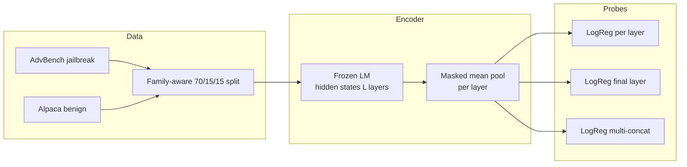

# White-box jailbreak detection via linear probes

## Motivation

Deployed language models need monitoring signals that fire before harmful completions are emitted. White-box methods can read internal activations at inference time, enabling classifiers that do not depend on brittle string rules. This project implements a minimal, reproducible pipeline: frozen backbone (e.g., GPT-2 medium) → layer-wise mean-pooled hidden states → logistic-regression probes, trained on AdvBench-style jailbreak prompts versus benign Alpaca instructions. The goal is to study, in depth, a linear separator that emerges and whether multi-layer aggregation improves over the best single layer—connecting to AI control and oversight themes (latent monitoring, residual risk measurement, and defense-in-depth around automated agents).

## Method overview

| Stage | What happens |
|--------|----------------|
| Data | ~500 jailbreak + ~500 benign; **families** via TF-IDF + clustering; **no family appears in more than one split** (train/val/test). |
| Features | `transformers` `AutoModel`, `output_hidden_states=True`, **masked mean pool** over tokens per layer. |
| Probes | (1) **one logistic regression per layer**, (2) **final layer only**, (3) **concatenate** selected layers (default: all), one classifier. |
| Eval | AUROC / FPR-style rates; **paraphrase robustness** on jailbreak subsample; optional **early truncation** (first *N* tokens). |



## Repository layout

```
jailbreak-probe/
├── README.md
├── requirements.txt
├── data/
│   └── prepare_dataset.py
├── features/
│   └── extract_hidden_states.py
├── probes/
│   └── train_probes.py
├── eval/
│   └── evaluate.py
├── notebooks/
│   └── results_analysis.ipynb
├── data/processed/          # generated CSVs (gitignored)
├── features/cache/          # generated .npz (gitignored)
├── probes/artifacts/        # trained probes + train_summary.json (gitignored)
└── results/metrics.json     # written by eval (gitignored)
```

## Commands to run

From the project root:

```bash
python -m venv .venv && source .venv/bin/activate
pip install -r requirements.txt

python data/prepare_dataset.py
python features/extract_hidden_states.py --model-name gpt2-medium --batch-size 8
python probes/train_probes.py --model-name gpt2-medium
python eval/evaluate.py --model-name gpt2-medium
```

- **Gated AdvBench**: the script tries `walledai/AdvBench` first; if your Hugging Face account has not accepted the gate, it **falls back** to `yukiyounai/AdvBench` (same 520-prompt benchmark format). To force the gated source after access approval, set `HF_TOKEN` and run with `--jailbreak-dataset walledai/AdvBench`.
- **Larger models** (GPU): pass e.g. `--model-name meta-llama/Llama-3.2-1B` or `mistralai/Mistral-7B-v0.1` to the feature and eval scripts (VRAM permitting).

### Layer-wise AUROC plot

After training, `probes/artifacts/train_summary.json` contains `val_auroc_per_layer`. Open `notebooks/results_analysis.ipynb` and run the first code cell to plot AUROC versus layer index (matplotlib).

### Interpreting and reporting results (honest framing)

**Lead with paraphrase robustness in applications.** The most informative signal for monitoring and adversarial robustness is often `paraphrase_robustness` in `results/metrics.json`: cheap template / typo-style rewrites can **lower** mean probe scores on jailbreak text while still flagging many variants. That pattern—**partial robustness plus a clear attack surface**—is exactly the kind of nuance oversight systems need. When you cite this project in an application, emphasize that stress test first, then headline AUROC.

**AUROC can saturate on a small holdout set.** It is normal to see AUROC at or near **1.0** on several layers when the test split is modest (on the order of **n ≈ 100–150** examples after family-aware grouping). That suggests **strong linear separability on this distribution**, not that the problem is “solved” in the wild. Report those numbers, but qualify them: small *n*, single backbone, single benchmark pairing—interpret cautiously.

**FPR on benign needs a sample-size caveat.** `fpr_at_prob_0.5_on_benign` is computed on **held-out benign prompts only**; with on the order of **~65** negatives, **one** flipped example moves the rate by about **1.5 percentage points**. Treat headline FPR as **illustrative**, not a stable production estimate—repeat with more data or bootstrap confidence intervals if you need rigor.

### Results table (fill after you run)

| Probe | Val AUROC (best single layer) | Val AUROC (final layer) | Val AUROC (multi-concat) | Test AUROC (final) | Test AUROC (multi) |
|--------|-------------------------------|-------------------------|---------------------------|--------------------|--------------------|
| GPT-2 medium | see `train_summary.json` → `best_single_layer_auroc` | `val_auroc_final_layer` | `val_auroc_multi_concat` | `metrics.json` | `metrics.json` |

**Per-layer test AUROC** is in `results/metrics.json` under `per_layer_test_auroc` (index = layer, 0 = embeddings).

**False positives on clean inputs**: `metrics.json` reports `fpr_at_prob_0.5_on_benign` and a **negative-only** thresholding note under `fpr_calibration_5pct_neg` (TPR/FPR at a score threshold derived from ~5% FPR on negatives—read as a calibration-style diagnostic, not a production guarantee).

**Perturbation robustness**: `paraphrase_robustness` compares scores on held-out jailbreak prompts versus **light template / typo-style paraphrases** (no external LLM by default). Swap in your own paraphraser inside `eval/evaluate.py` for stronger stress tests.

**Bonus — early tokens**: `eval/evaluate.py` defaults to `--early-tokens 50,100`, re-encoding the test set with shorter `max_length` and reporting AUROC for the **multi-layer probe trained on full-length features** (train/eval mismatch is intentional: it measures how detection degrades when only prefixes are visible—relevant to streaming).

## Limitations

- **GPT-2 is not a chat-aligned model.** Probes trained on GPT-2 activations **do not directly transfer** to frontier chat models; they demonstrate the *method* (layer structure, pooling, probe types) cheaply on CPU.
- **Linear probes** can track dataset-specific shortcuts; paraphrase and OOD tests are essential before trusting deployability.
- **Family clustering** is a pragmatic proxy for “prompt families”; it is not identical to human-defined taxonomies in AdvBench.
- **Jailbreak labels** are instruction-level; multi-turn or tool-augmented attacks are out of scope here.

## References

- **AdvBench** harmful behaviors benchmark: Andy Zou, Zifan Wang, J. Zico Kolter, Matt Fredrikson, “Universal and Transferable Adversarial Attacks on Aligned Language Models,” 2023. Dataset often cited as **AdvBench** (520 behaviors); Hugging Face: `walledai/AdvBench` (gated) — see also public mirrors of the same benchmark.
- **Latent Sentinel** (layer-wise real-time jailbreak detection with probes): Jea Sung Kim & Suan Lee, *Latent Sentinel: Real-Time Jailbreak Detection with Layer-wise Probes*, OpenReview: [https://openreview.net/forum?id=tuFRx6Ww2n](https://openreview.net/forum?id=tuFRx6Ww2n).

## License

Research code for education and experimentation. AdvBench and Alpaca have their own dataset terms—review before redistribution.
